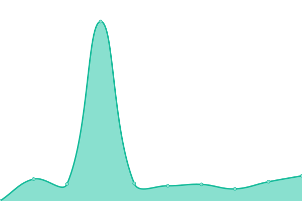

# [📈 Live Status](https://b-eee.github.io/ServiceUptime-STG): <!--live status--> **🟧 Partial outage**

This repository contains the open-source uptime monitor and status page for [Hexabase](https://b-eee.github.io/ServiceUptime-STG), powered by [Upptime](https://github.com/upptime/upptime).

With [Upptime](https://upptime.js.org), you can get your own unlimited and free uptime monitor and status page, powered entirely by a GitHub repository. We use [Issues](https://github.com/b-eee/ServiceUptime-STG/issues) as incident reports, [Actions](https://github.com/b-eee/ServiceUptime-STG/actions) as uptime monitors, and [Pages](https://b-eee.github.io/ServiceUptime-STG) for the status page.

<!--start: status pages-->
<!-- This summary is generated by Upptime (https://github.com/upptime/upptime) -->
<!-- Do not edit this manually, your changes will be overwritten -->
<!-- prettier-ignore -->
| URL | Status | History | Response Time | Uptime |
| --- | ------ | ------- | ------------- | ------ |
|  [Hexabase Staging Login](https://az.hexabase.com/login) | 🟥 Down | [hexabase-staging-login.yml](https://github.com/b-eee/ServiceUptimeSTG/commits/HEAD/history/hexabase-staging-login.yml) | 

 532ms
     
 | 

<a href="https://b-eee.github.io/ServiceUptimeSTG/history/hexabase-staging-login">100.00%</a>
    

|  [Hexabase Staging API](https://az-api.hexabase.com/health_check) | 🟩 Up | [hexabase-staging-api.yml](https://github.com/b-eee/ServiceUptimeSTG/commits/HEAD/history/hexabase-staging-api.yml) | 

 467ms
     
 | 

<a href="https://b-eee.github.io/ServiceUptimeSTG/history/hexabase-staging-api">100.00%</a>
    

|  [Community Site](https://community.hexabase.com) | 🟩 Up | [community-site.yml](https://github.com/b-eee/ServiceUptimeSTG/commits/HEAD/history/community-site.yml) | 

 650ms
     
 | 

<a href="https://b-eee.github.io/ServiceUptimeSTG/history/community-site">100.00%</a>
    

|  [Apicore Service](https://az-hxg.hexabase.com/apicore/health_check) | 🟥 Down | [apicore-service.yml](https://github.com/b-eee/ServiceUptimeSTG/commits/HEAD/history/apicore-service.yml) | 

 481ms
     
 | 

<a href="https://b-eee.github.io/ServiceUptimeSTG/history/apicore-service">100.00%</a>
    

|  [LinkerAPI Service](https://az-hxg.hexabase.com/linkerapi/health_check) | 🟥 Down | [linker-api-service.yml](https://github.com/b-eee/ServiceUptimeSTG/commits/HEAD/history/linker-api-service.yml) | 

 141ms
     
 | 

<a href="https://b-eee.github.io/ServiceUptimeSTG/history/linker-api-service">100.00%</a>
    

<!--end: status pages-->

[**Visit our status website →**](https://b-eee.github.io/ServiceUptime-STG)

## 📄 License

- Powered by: [Upptime](https://github.com/upptime/upptime)
- Code: [MIT](./LICENSE) © [Hexabase](https://b-eee.github.io/ServiceUptime-STG)
- Data in the `./history` directory: [Open Database License](https://opendatacommons.org/licenses/odbl/1-0/)
